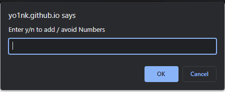
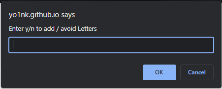
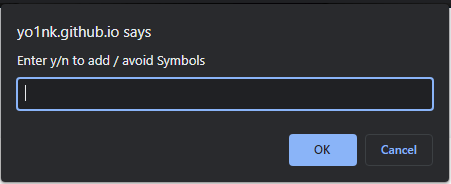
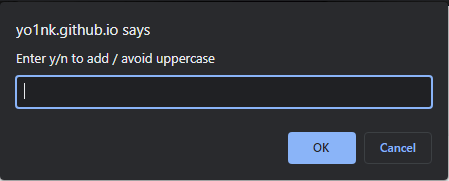
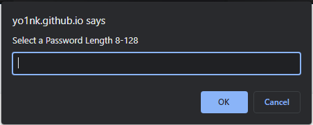

# Password-Generator

## Description

Provide a short description explaining the what, why, and how of your project. Use the following questions as a guide:

- My motivation was to make a succesful password generator
- It solves the problem of having to come up with your own password
- I learned you can add multiples variables into one from different lines

## Usage

When you press the generate password button prompts will appear on the screen and it will allow you to generate a password based on your criteria

To add a screenshot, create an `assets/images` folder in your repository and upload your screenshot to it. Then, using the relative file path, add it to your README using the following syntax:

## License

Refer to License file
